# Presentation Documentation
## Goals and Achievements
G is a big spender and a big worker. He hasn't had time to sit down and look through his bank to see everything that he buys
and gains. Recently, he had been trying to keep better track of his expenses and asked me to create him an app that would do so.

Some things in this application that he wanted:

    REQUIREMENTS:
        - A way to read a transaction csv file:
            G keeps track of all his information in tables and excel sheets
        - A way to write new transactions into the csv file without opening a new program: 
            G wants everything to be streamline

        - A way to display all transactions, deposits, payments, searched transactions

        - A way to calculate total expenses/income of:
            - Month To Date,
            - previous month
            - Year To Date,
            - previous year
        - A way to search transactions by vendor.
        - A way to search transactions by any/all categories.

I was able to achieve all of this along with more! There was added error handling, case handling, and more! 
G ended up as a happy customer!


## Architecture -- Two classes with several methods --> a bunch of classes --> MVC
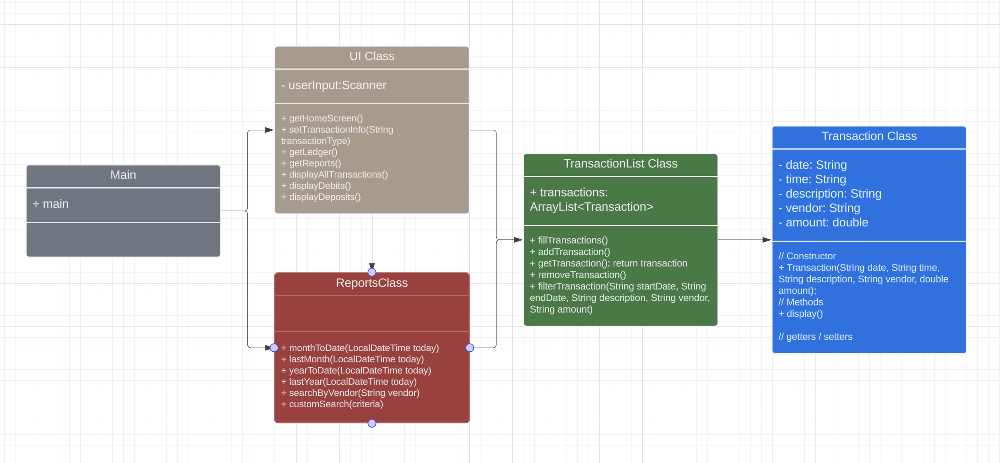
+ First UML Diagram once I decided I wanted to separate into different classes.

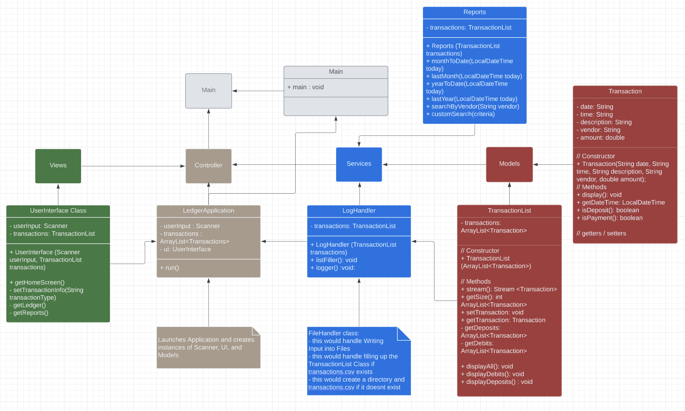
+ Second UML Diagram after I wanted to utilize MVC

### Main Class
>This essentially did nothing but execute the AccountingLedger Class.

### Application (Controller)
#### *1. AccountingLedger Class*
> The job of this class was to:
> 1. Create instances of our objects.
> 2. Initialize our TransactionList if a transaction.csv file already exists.
> 3. Create a logs folder and/or transaction.csv file if they don't exist.
> 4. Work between the UserInterface, Models, and Services.

### Models
#### *1. Transaction Class*
> 1. Used to store information of a transaction found in the transaction.csv file
> 2. Stores date, time, description, vendor, and amount.
> 3. Has Getters and Methods
>    1. was supposed to have Setters, but ended up UNUSED -- so I removed the code.
>    2. Methods include a way to display transaction, get full date-time, and get find out if its a deposit or payment.

#### *2. TransactionList Class*
> 1. Stores an ArrayList of Transactions.
> 2. Methods include:
>    1. a way to filter transactions
>    2. display payments only
>    3. display deposits only
>    4. display all transactions

### UI (Views)
#### *1. UserInterface Class*
> 1. Contains all screens for the application. 
> 2. Anything that we see is displayed here.
> 3. No logic.

| 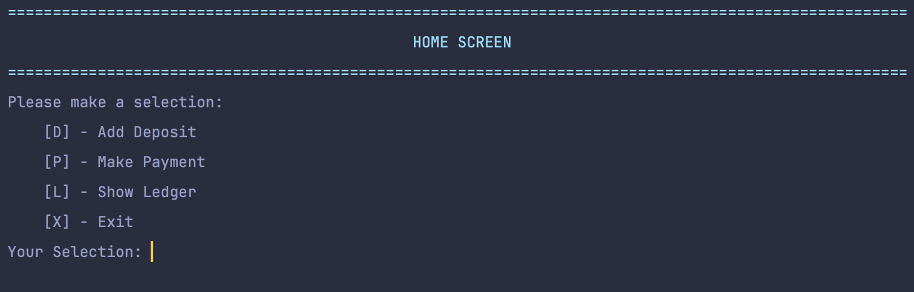    |                                       |
|-----------------------------------------|---------------------------------------|
| 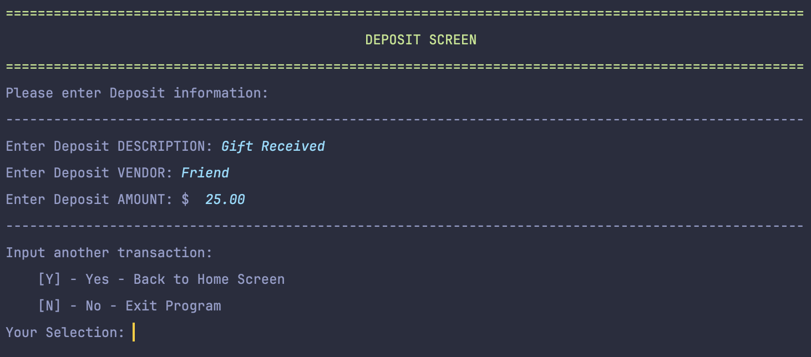 | 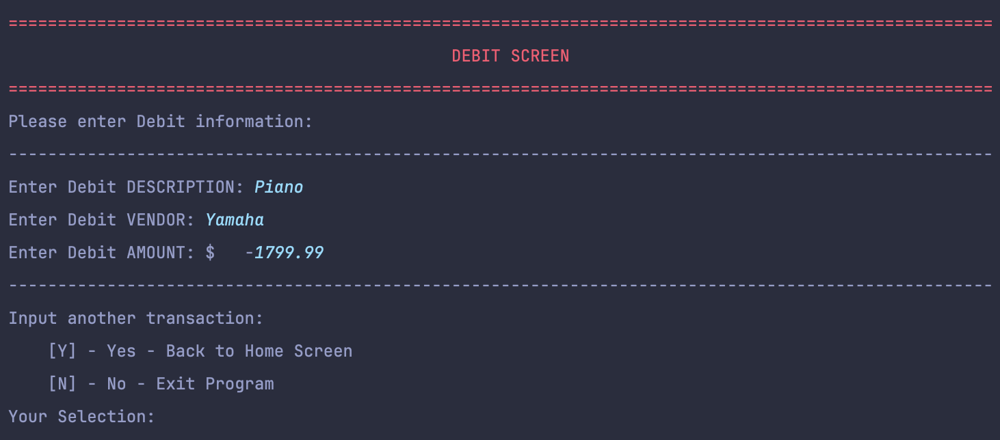 |

#### *2. UIColors Class*
> 1. A bunch of constants of color codes to be used throughout the project 
> 2. for UI purposes:
>    1. using RED for Payments (negative $) and GREEN for Deposits (positive $)
>    2. using Different color for titles of different screens.

### Services
#### *1. LogHandler Class*
> 1. Used to handle File Input and Output.
> 2. Creates new directory if not found, Creates new Transaction.csv if not found
> 3. If found, fills TransactionList with data in transaction.csv
> 4. Handles writing a new transaction into file.

#### *2. Reports Class*
> 1. Contains different logic for the reports Screen.
>    1. Adds a bunch of different values in transaction list to get the desired output
> 2. utilizes filtering to handle different methods based on desire


## Code and Logic
### Display Logic
```java
public void display() {
    String output = String.format(
            PURPLE +"\t%-10s" + RESET + 
            BLUE + "\t%-10s" + RESET +
            YELLOW + "\t%-30s" + RESET +
            CYAN + "\t%-20s\t" + RESET,
            currentDate,currentTime, description, vendor);
    String amountOutput = amount > 0 ? String.format(GREEN + "$\t%8.2f" + RESET, amount) : String.format(RED + "$\t%8.2f" + RESET, amount);
    System.out.println(output+amountOutput);
}
```

| 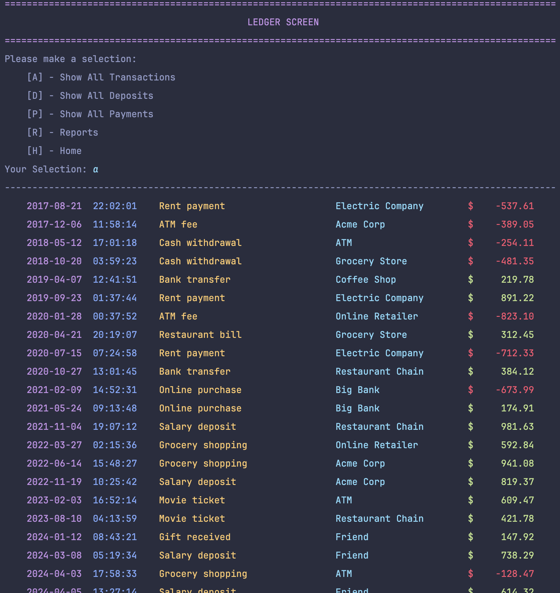      |                                              |
|----------------------------------------------|----------------------------------------------|
| 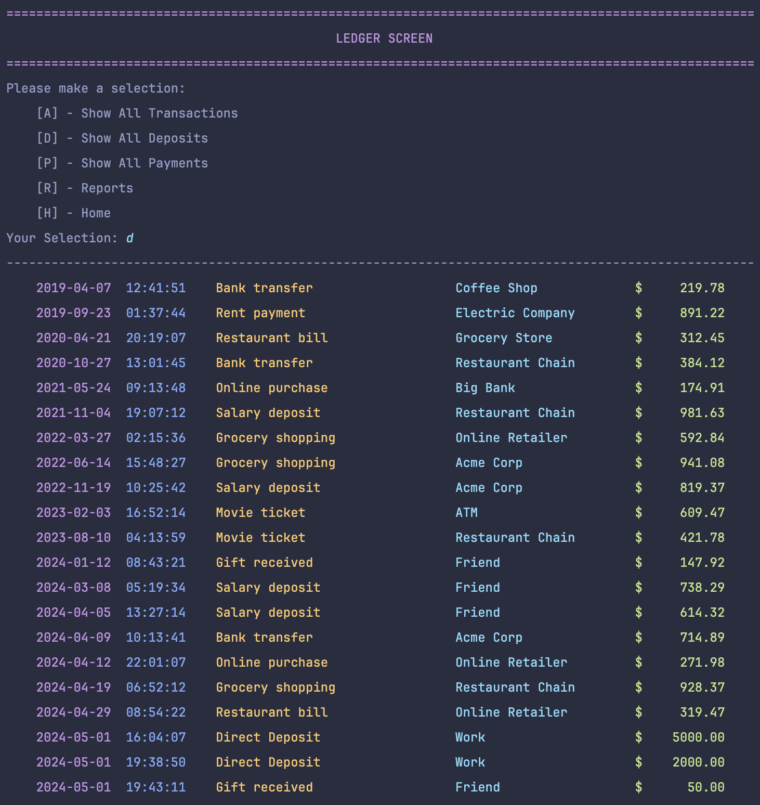 | 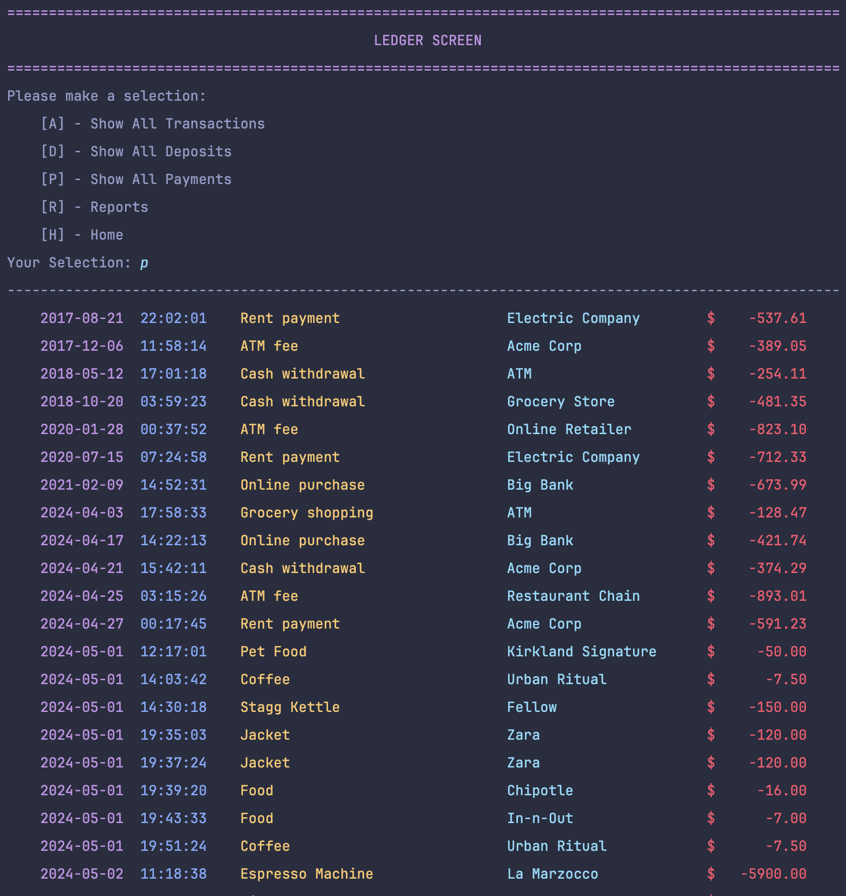 |


### Reports Logic
A lot of this logic was stuff I had to look up in documentation.
```java
public static double monthToDate(LocalDateTime today) {
    return transactions.stream()
            .filter(transaction -> transaction.getDate().getYear() == today.getYear())
            .filter(transaction -> transaction.getDate().getMonthValue() == today.getMonthValue())
            .filter(transaction -> transaction.getDate().getDayOfMonth() <= today.getDayOfMonth())
            .mapToDouble(Transaction::getAmount)
            .sum();
}
```
`.filter`
> was used along with a lambda function to only show transactions in the stream the are true for the logic
>
>[More Info](https://www.geeksforgeeks.org/stream-filter-java-examples/)

`.mapToDouble`
> was to return each `transaction.getAmount()`'s double value
>
>[More Info](https://www.geeksforgeeks.org/stream-maptodouble-java-examples/)

`the double colon operator ::`
> I found out this was just a shorthand way to return simple functions...
>
> SHORTER THAN lambda which a was wild to me (IntelliJ introduced it to me and it started making sense)
>
`.sum()`
> was used to add all the Doubles mapped from mapToDouble
>
> [More Info](https://www.geeksforgeeks.org/sum-list-stream-filter-java/)

So in conclusion... for this `monthToDate(LocalDateTime today)` method, I stream the information coming
from the transactions ArrayList object. I then filter to see only those in the current year. I filter to see only the transactions
made in the same month as today. I filter to see only transactions before and on today. I then return all the amounts in the list
as a double, and add them all together! This is all returned from the function.
Outcome:

| 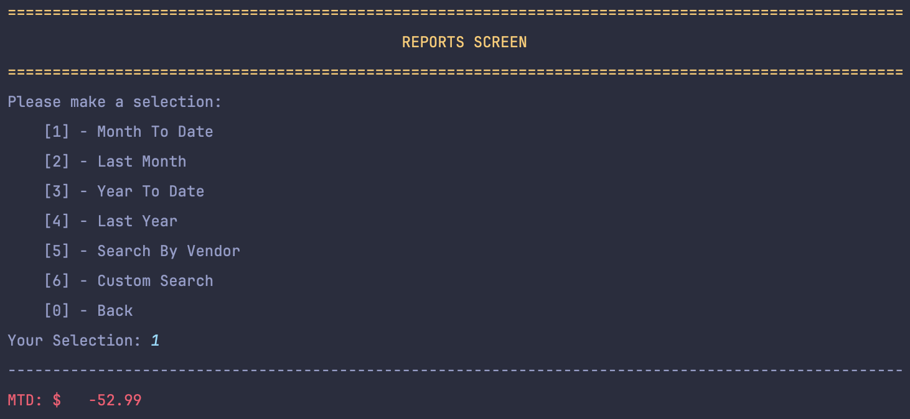          | 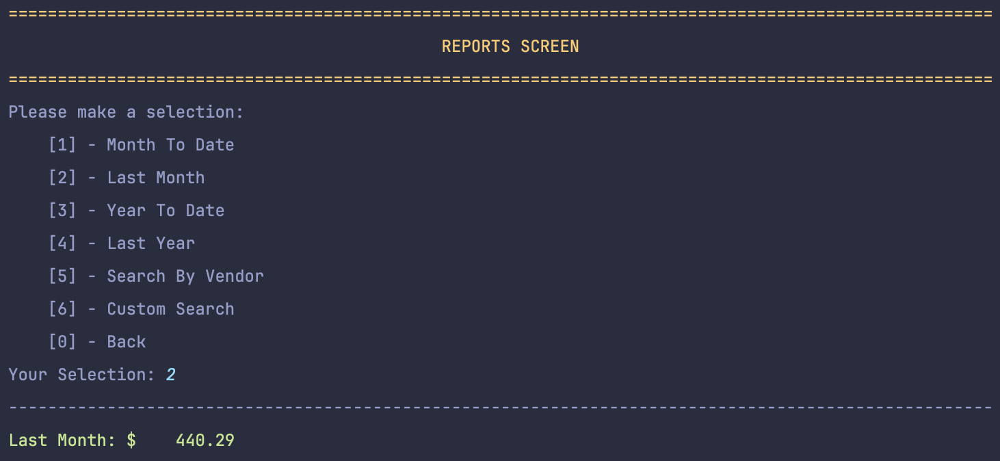 |
|-----------------------------------------------|--------------------------------------------------|
| 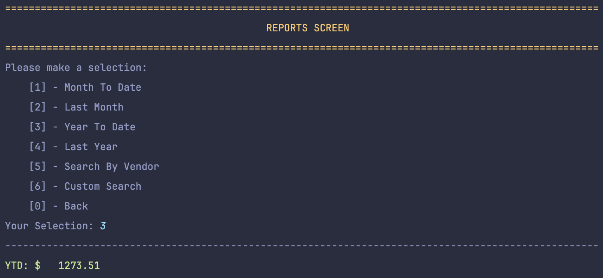          | 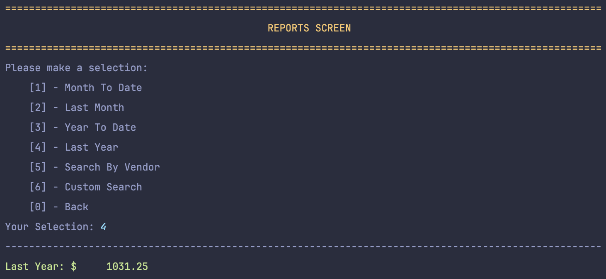        |

### Search Logic
**_Filtering Vendor_**
```java
public static void searchVendor(String input) {     
    transactions.stream()
            .filter(transaction -> transaction.getVendor().equalsIgnoreCase(input))
            .forEach(Transaction::display);
}
```
This literally just takes the input and checks to see if any of the transactions in the stream have the same vendor as 
input. It then displays the filtered transactions.
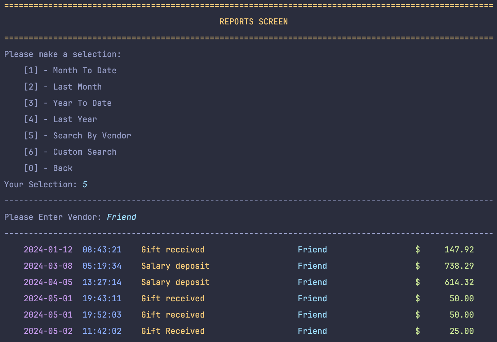

**_Advanced Filtering_**
```java
public static void filterTransactions(String start , String end, String description, String vendor, String amount) {
    ArrayList<Transaction> filteredTransactions = new ArrayList<>();
    
    transactions.stream()
            .filter(transaction -> (start.isEmpty() || transaction.getDate().isAfter(LocalDateTime.parse(start, DateTimeFormatter.ofPattern("yyyy-MM-dd HH:mm:ss")).minusDays(1))))
            .filter(transaction -> (end.isEmpty() || transaction.getDate().isBefore(LocalDateTime.parse(end, DateTimeFormatter.ofPattern("yyyy-MM-dd HH:mm:ss")).plusDays(1))))
            .filter(transaction -> (description.isEmpty() || transaction.getDescription().equalsIgnoreCase(description)))
            .filter(transaction -> (vendor.isEmpty() || transaction.getVendor().equalsIgnoreCase(vendor)))
            .filter(transaction -> (amount.isEmpty() || transaction.getAmount() == Double.parseDouble(amount)))
            .forEach(filteredTransactions::add);
    
    if (filteredTransactions.isEmpty()) {
        System.out.println("No Available transactions");
    } else {
        System.out.println("Filtered Transactions:");
        filteredTransactions.stream().forEach(Transaction::display);
    }
}
```
With the stream, I am using the `||` operator within the `.filter` portion. This basically lets us know to filter
if value for criteria is found or it just returns true for filter showing all transactions for the value asked. Then it
the `.forEach` method to implement `filteredTransactions.add(current object in stream)`. If the new filtered ArrayList is
empty, we show that there are no available transactions. otherwise we display every transaction in `filteredTransactions`.

|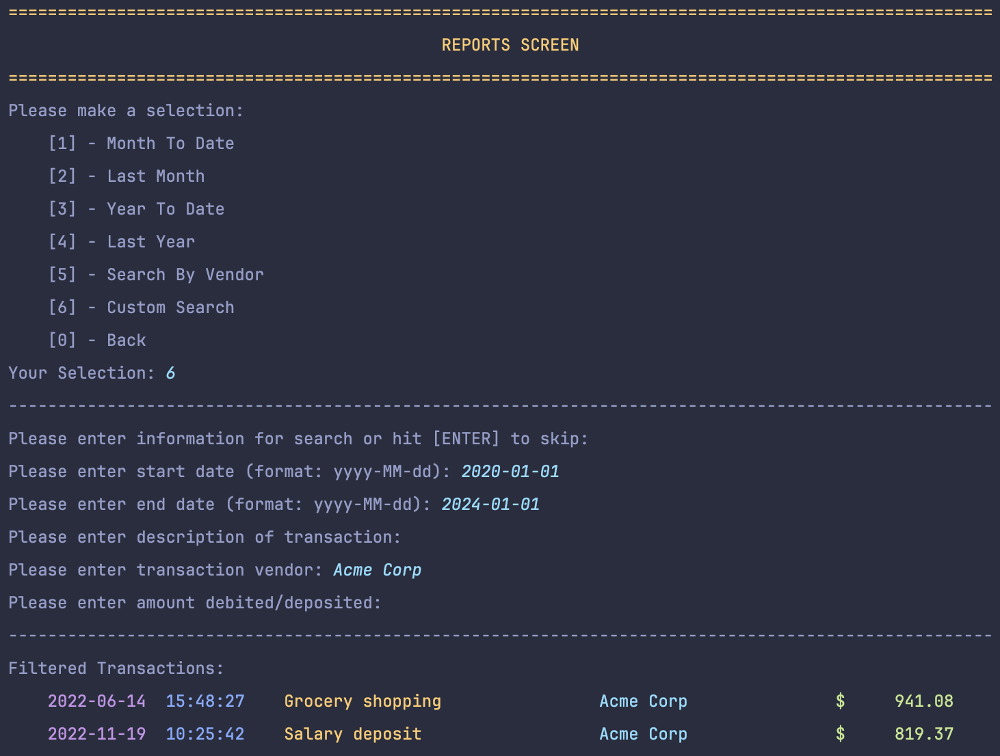  | 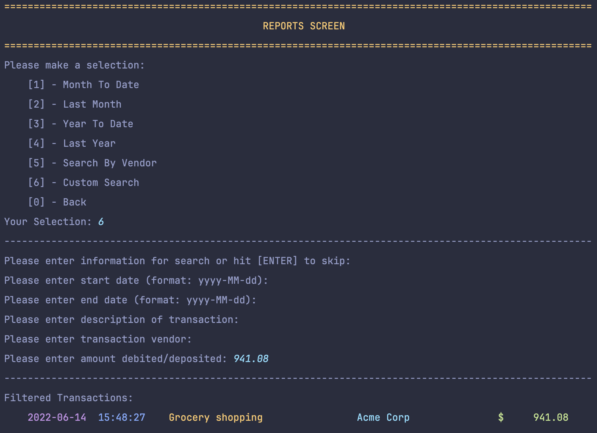 |
|------------------------------------------------|------------------------------------------------|
