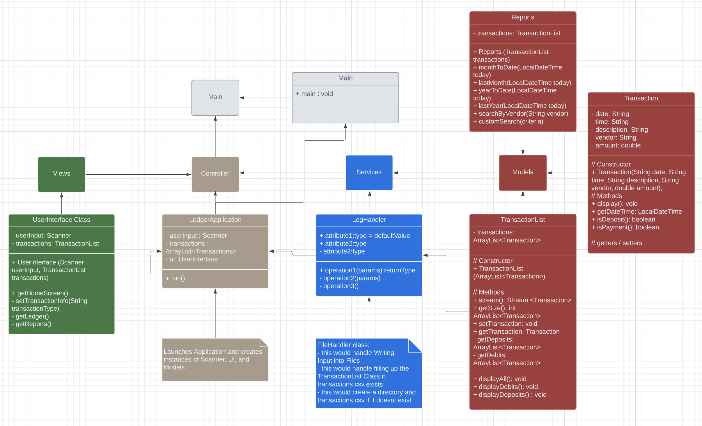

# Capstone 1 - Accounting Ledger 
# LOG
##### [April 29: (click as link)](#april-29)
I am currently coding this project in a very basic way. The project feels very clunky at the moment.
After figuring out all my main code, I plan on updating my code to be more organized. I want to challenge myself
using an MVC architecture -- which Gregor vaguely introduced a while ago.
##### [April 30: (click as link)](#april-30---new-structure)
I wasn't able to do a MVC architecture, but I was able to organize everything in a new way
##### [May 1: (click as link)](#may-1)
Today I am working on the organization of my capstone classes again. I plan on updating methods to be properly public and private.
I am going to be creating a bunch of constructors, and edit the code so that it is using an instance of the class
instead of directly using the class.
--NEW Gregor introduced a mini INTRO to MVC architecture demo! I will be using this to my advantage and try to implement it. 
Also will be working on USER INTERFACE (remember use %-20s)

---

# April 29

## Main Class
### Screens
> **Home Screen:**
> - Add deposit
> - Add debit
> - Move to Ledger Screen
> - Exit
>
> **Ledger Screen:**
> - Display All Entries
> - Display only deposits
> - Display payments
> - Show Reports Screen
> - Show Home Screen
> 
> **Reports Screen:**
> - Show Month to Date
> - Show Previous MTD
> - Show Year to Date
> - Show Previous YTD
> - Search by Vendor
> - Move to Custom Search Screen
> - Back to Ledger Screen
> 
> **Custom Search Screen:**
> - Start Date
> - End Date
> - Description
> - Vendor
> - Amount
>

---

### IO Usage
There are a lot of I/O usage -- 
- used a lot of userInput using scanner
- usage of PrintWriter and FileWriter to create a new csv file
- usage of Scanner to read csv lines and place it into the Transactions ArrayList
### Class Usage
I wanted to keep things organized. Even though we are storing all of our information into a log file, 
I wanted to make it easier for myself later on... I wouldn't need to constantly open and close a file
in order to retrieve information that I need if everything is stored in a Transaction class.
### List Usage
Expanding on the Transaction class, each transaction is stored in an ArrayList object. This will allow
for easier filtering and searching! For example:
```java
    // NOT MY ACTUAL CODE BUT SIMILAR TO WHAT I DID
    ArrayList <Transaction> transactions = new ArrayList<>();
    //... code that shows adds csv information into ArrayList ...
    transactions.stream()
        .filter(transaction -> transaction.getAmount > 0)
        .forEach(transaction -> System.out.println(transaction.getDescription()));
```
This basically filters the Transactions to only show those that are Payments (negative) 
### Exception Handling
I used the try/catch statement to handle any File Exceptions and if something wasn't a correct data type.
### LocalDateTime
This was used to log the current time and date of the transaction. Will be used in later Reports.
## Transaction Class
### Private Variables
```java
    private String currentDate;
    private String currentTime;
    private String description;
    private String vendor;
    private double amount;
```
### Constructor
```java
    public Transaction(String currentDate, String currentTime, String description, String vendor, double amount) {
        this.currentDate = currentDate;
        this.currentTime = currentTime;
        this.description = description;
        this.vendor = vendor;
        this.amount = amount;
    }
```
### Getters/Setters
The setters are kind of useless at the moment. I might add some kind of usage for the setters later on in the project.
The getters are being used for comparison in the main class.
### Methods
My only method in the Transaction class is the display method. This is so i can easily diplay the transaction object 
especially when filtering.
```java
    public void display(){
        String output = String.format("%s\t%s\t%s\t%s\t$%4.2f",
                currentDate,currentTime, description, vendor, amount);
        System.out.println(output);
    }
```
---

# APRIL 30 - *NEW STRUCTURE*
1. Transaction Class:

This class would hold the properties and functionalities related to a single transaction.

    Properties:
        - date (String)
        - time (String)
        - description (String)
        - vendor (String)
        - amount (double)
    Methods:
        + Constructor to initialize the properties
        + display() - This method would format and print the transaction details

2. TransactionList Class:

This class would manage a list of transactions and provide methods to add, remove, search, and filter transactions.

    Properties:
        + transactions (ArrayList<Transaction>) - A list to store Transaction objects

    Methods:
        // SCRUM Methods -- these just utilize ArrayList.add/.get/.remove etc
        + addTransaction(Transaction transaction) - Adds a transaction to the list
        + getTransaction(int index) - Returns the transaction at a specific index
        + removeTransaction(int index) - Removes the transaction at a specific index
        + filterTransactions(criteria) - This method would filter transactions based on different criteria (date, vendor, amount, etc.)
        + displayAll() - This method would call the TransactionList class method to display all transactions.
        + displayDeposits() - Similar to displayAll but for Deposits
        + displayDebits() - Similar to displayAll but for Debits

3. UserInterface Class:

This class would handle user interactions and display the application screens.

    Properties:
        - scanner (Scanner) - Scanner object to read user input
    Methods:
        + getHomeScreen() - This method would display the home screen with options for adding deposits, making payments, showing the ledger, and exiting.
        + setTransactionInfo(String transactionType) - This method would handle user input for transaction details (description, vendor, amount) based on the transaction type (deposit or payment).
        + getLedger() - This method would display the ledger screen with options for showing all transactions, deposits, payments, reports, and going back to the home screen.
        + getReports() - This method would display the reports screen with options for month-to-date, last month, year-to-date, last year, search by vendor, custom search, and going back to the ledger screen.
        - display(int i) - This method would call the TransactionList class method to display certain or all transactions.

4. Reports Class:

This class would handle generating different reports based on transaction data.

    Methods:
        monthToDate(LocalDateTime today) - This method would calculate the total amount for transactions from the beginning of the month to the current date. (similar methods for 
        lastMonth(LocalDateTime today) - This method caluclate the total amount for transactions in the previous month.
        yearToDate(LocalDateTime today) - Similar to monthToDate but for the year
        lastYear(LocalDateTime today) - Similar to lastMonth but for the year
        searchByVendor(String vendor) - This method would use the TransactionList class method to filter transactions by vendor and then display them.
        customSearch(criteria) - This method would use the TransactionList class method to filter transactions based on various criteria provided by the user and then display them.

5. Main Class:

This class would call the filler method in TransactionList to fill the TransactionList if Log exists. Will create a new file and directory if not found. 
It would then start the program by entering the first UserInterface Screen.

---
### Concerning Logic
#### 1. Most of the MTD, YTD, lastMonth, lastYear methods have similar logic

A lot of this logic was stuff I had to look up in documentation.
```java
    public static double monthToDate(LocalDateTime today) {
        return transactions.stream()
                .filter(transaction -> transaction.getDate().getYear() == today.getYear())
                .filter(transaction -> transaction.getDate().getMonthValue() == today.getMonthValue())
                .filter(transaction -> transaction.getDate().getDayOfMonth() <= today.getDayOfMonth())
                .mapToDouble(Transaction::getAmount)
                .sum();
    }
```
`.filter`
> was used along with a lambda function to only show transactions in the stream the are true for the logic
> 
>[More Info](https://www.geeksforgeeks.org/stream-filter-java-examples/)

`.mapToDouble`
> was to return each `transaction.getAmount()`'s double value
>
>[More Info](https://www.geeksforgeeks.org/stream-maptodouble-java-examples/)

`the double colo operator ::`
> I found out this was just a shorthand way to return simple functions...
> 
> SHORTER THAN lambda which a was wild to me (IntelliJ introduced it to me and it started making sense)
> 
`.sum()`
> was used to add all the Doubles mapped from mapToDouble
> 
> [More Info](https://www.geeksforgeeks.org/sum-list-stream-filter-java/)

So in conclusion... for this `monthToDate(LocalDateTime today)` method, I stream the information coming
from the transactions ArrayList object. I then filter to see only those in the current year. I filter to see only the transactions
made in the same month as today. I filter to see only transactions before and on today. I then return all the amounts in the list
as a double, and add them all together! This is all returned from the function.

#### 2. Filtering Vendor and Optional Filtering

**_Filtering Vendor_**
```java
    public static void searchVendor(String input) {
        transactions.stream()
                .filter(transaction -> transaction.getVendor().equalsIgnoreCase(input))
                .forEach(Transaction::display);
    }
```
This literally just takes the input and checks to see if any of the transactions in the stream have the same vendor as 
input. It then displays the filtered transactions.

**_Advanced Filtering_**
```java
    public static void filterTransactions(String start , String end, String description, String vendor, String amount) {
        // Collect filtered transactions based on user input
        ArrayList<Transaction> filteredTransactions = new ArrayList<>();
    
        transactions.stream()
                .filter(transaction -> (start.isEmpty() || transaction.getDate().isAfter(LocalDateTime.parse(start, DateTimeFormatter.ofPattern("yyyy-MM-dd HH:mm:ss")).minusDays(1))))
                .filter(transaction -> (end.isEmpty() || transaction.getDate().isBefore(LocalDateTime.parse(end, DateTimeFormatter.ofPattern("yyyy-MM-dd HH:mm:ss")).plusDays(1))))
                .filter(transaction -> (description.isEmpty() || transaction.getDescription().equalsIgnoreCase(description)))
                .filter(transaction -> (vendor.isEmpty() || transaction.getVendor().equalsIgnoreCase(vendor)))
                .filter(transaction -> (amount.isEmpty() || transaction.getAmount() == Double.parseDouble(amount)))
                .forEach(filteredTransactions::add);
    
        if (filteredTransactions.isEmpty()) {
            System.out.println("No Available transactions");
        } else {
            System.out.println("Filtered Transactions:");
            filteredTransactions.stream().forEach(Transaction::display);
        }
    }
```
With the stream, I am using the `||` operator within the `.filter` portion. This basically lets us know to filter
if value for criteria is found or it just returns true for filter showing all transactions for the value asked. Then it 
the `.forEach` method to implement `filteredTransactions.add(current object in stream)`. If the new filtered ArrayList is
empty, we show that there are no available transactions. otherwise we display every transaction in `filteredTransactions`.
# May 1
Okay, I was able to change everything to what I wanted! I was able to get a beginner's grasp of MVC. 
I did my best to implement it!

